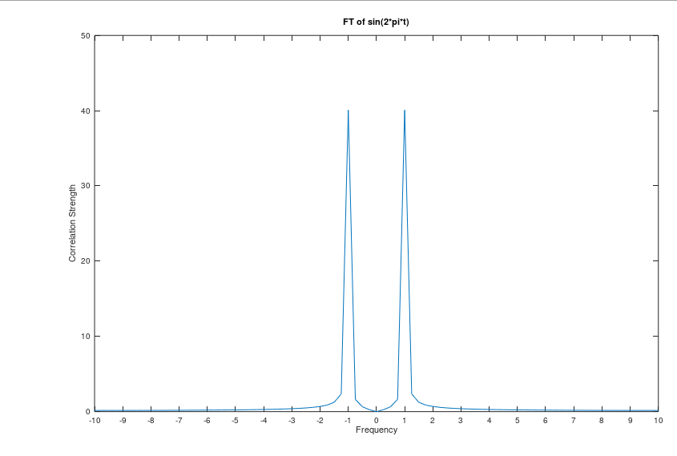

# Pulse Estimator

Work in progress....

## Fourier Transform

Fourier transform can be used to identified Doppler Frequencies of moving targets.

Below is a graph of a sinuisodal function with a frequency of 1 Hz

The sampling frequency is 20 samples/second.

Using the Fast Fourier Transform technique yields the following curve in the frequency domain:

The peak frequency is located at the -/+1 Hz mark, which corresponds to the known frequency of the sine function.

## Octave Output

